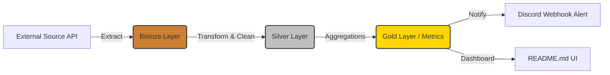

# 📈 Gold Price Data Pipeline

An enterprise-grade Data Engineering & Analytics Engineering pipeline built to automatically ingest, transform, and alert on Vietnam's domestic gold prices using the Medallion Architecture.

   

> **Latest Pipeline Run:** 2026-06-17 11:49:46 (ICT) 
> **Key Metric (SJC):** Buy **149.800.000** VND — Sell **151.800.000** VND

## 🏗 System Architecture (ELT)

We employ a robust ELT approach coupled with the **Medallion Data Architecture**:

- **Bronze (`data/bronze/`)**: Raw immutable JSON snapshots appended continuously.
- **Silver (`data/silver/`)**: Cleaned, deduplicated, and normalized historical tabular data.
- **Gold (In-Memory/UI)**: Business-level aggregations (trends, spread calculations, day-over-day changes).

## 🎯 Gold Layer: Executive Metrics (2026-06-17)

| Metric | Value (VND/lượng) |
|---|---|
| Ask (Buy) | **149.800.000** |
| Bid (Sell) | **151.800.000** |
| Spread | 2.000.000 |

## 🏷 Market Overview by Brand

| Brand | Ask (VND) | Bid (VND) | Spread |
|---|---:|---:|---:|
| BTMC SJC | 149.800.000 | 151.800.000 | 2.000.000 |
| BTMH | 149.000.000 | 152.000.000 | 3.000.000 |
| DOJI HN | 149.800.000 | 151.800.000 | 2.000.000 |
| DOJI SG | 149.800.000 | 151.800.000 | 2.000.000 |
| PNJ Hà Nội | 148.800.000 | 151.800.000 | 3.000.000 |
| PNJ TP.HCM | 148.800.000 | 151.800.000 | 3.000.000 |
| Phú Qúy SJC | 149.800.000 | 151.800.000 | 2.000.000 |
| SJC | 149.800.000 | 151.800.000 | 2.000.000 |

## 📅 Historical Trend (10 Days)

**7-Day Sparkline:** Ask `▃▃  ▅▅▅▇▇█` · Bid `▄▄▂ ▅▅▅▇▇█`

| Date | Ask | Bid | Spread |
|---|---:|---:|---:|
| 08/06/2026 | 138.800.000 | 143.800.000 | 5.000.000 |
| 09/06/2026 | 138.800.000 | 143.800.000 | 5.000.000 |
| 10/06/2026 | 133.300.000 | 138.300.000 | 5.000.000 |
| 11/06/2026 | 131.000.000 | 136.000.000 | 5.000.000 |
| 12/06/2026 | 142.400.000 | 145.400.000 | 3.000.000 |
| 13/06/2026 | 144.000.000 | 147.000.000 | 3.000.000 |
| 14/06/2026 | 144.000.000 | 147.000.000 | 3.000.000 |
| 15/06/2026 | 148.000.000 | 150.500.000 | 2.500.000 |
| 16/06/2026 | 149.500.000 | 151.500.000 | 2.000.000 |
| 17/06/2026 | 149.800.000 | 151.800.000 | 2.000.000 |

## 📊 Day-Over-Day (DoD) Volatility

| Indicator | Delta (VND) |
|---|---|
| Ask Price | 📈 +300.000 (+0.20%) |
| Bid Price | 📈 +300.000 (+0.20%) |

## 🚀 Data Engineering Roadmap

- [x] **Phase 1:** Build local ELT Pipeline using Python & GitHub Actions.
- [x] **Phase 2:** Implement Medallion Architecture (Bronze/Silver/Gold).
- [x] **Phase 3:** Cloud Integration (Google Cloud Storage + BigQuery).
- [x] **Phase 4:** Analytics Engineering (Migrate transforms to `dbt`).
- [x] **Phase 5:** Orchestration (Migrate from GitHub Actions to Apache Airflow or Prefect).

---

_Pipeline triggered at **2026-06-17 11:49 +07** via [GitHub Actions](.github/workflows/daily-update.yml)._  
_Data Lineage: [`data/silver/prices.json`](data/silver/prices.json) · 37 historical snapshots (2026-06-04 → 2026-06-17)._  
_Setup & Configurations: [`docs/USAGE.md`](docs/USAGE.md). License: [MIT](LICENSE)._
