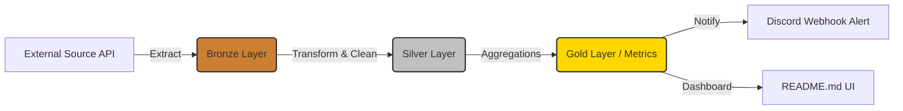

# 📈 Gold Price Data Pipeline

An enterprise-grade Data Engineering & Analytics Engineering pipeline built to automatically ingest, transform, and alert on Vietnam's domestic gold prices using the Medallion Architecture.

   

> **Latest Pipeline Run:** 2026-06-24 11:07:45 (ICT) 
> **Key Metric (SJC):** Buy **144.000.000** VND — Sell **147.000.000** VND

## 🏗 System Architecture (ELT)

We employ a robust ELT approach coupled with the **Medallion Data Architecture**:

- **Bronze (`data/bronze/`)**: Raw immutable JSON snapshots appended continuously.
- **Silver (`data/silver/`)**: Cleaned, deduplicated, and normalized historical tabular data.
- **Gold (In-Memory/UI)**: Business-level aggregations (trends, spread calculations, day-over-day changes).

## 🎯 Gold Layer: Executive Metrics (2026-06-24)

| Metric | Value (VND/lượng) |
|---|---|
| Ask (Buy) | **144.000.000** |
| Bid (Sell) | **147.000.000** |
| Spread | 3.000.000 |

## 🏷 Market Overview by Brand

| Brand | Ask (VND) | Bid (VND) | Spread |
|---|---:|---:|---:|
| BTMC SJC | 142.500.000 | 147.000.000 | 4.500.000 |
| BTMH | 142.500.000 | 146.500.000 | 4.000.000 |
| DOJI HN | 144.000.000 | 147.000.000 | 3.000.000 |
| DOJI SG | 144.000.000 | 147.000.000 | 3.000.000 |
| PNJ Hà Nội | 144.000.000 | 147.000.000 | 3.000.000 |
| PNJ TP.HCM | 144.000.000 | 147.000.000 | 3.000.000 |
| Phú Qúy SJC | 143.700.000 | 147.000.000 | 3.300.000 |
| SJC | 144.000.000 | 147.000.000 | 3.000.000 |

## 📅 Historical Trend (10 Days)

**7-Day Sparkline:** Ask `▅▇█▆   ▂▂ ` · Bid `▆▇█▇   ▂▂ `

| Date | Ask | Bid | Spread |
|---|---:|---:|---:|
| 15/06/2026 | 148.000.000 | 150.500.000 | 2.500.000 |
| 16/06/2026 | 149.500.000 | 151.500.000 | 2.000.000 |
| 17/06/2026 | 149.800.000 | 151.800.000 | 2.000.000 |
| 18/06/2026 | 148.800.000 | 151.300.000 | 2.500.000 |
| 19/06/2026 | 143.700.000 | 146.700.000 | 3.000.000 |
| 20/06/2026 | 144.200.000 | 147.200.000 | 3.000.000 |
| 21/06/2026 | 144.200.000 | 147.200.000 | 3.000.000 |
| 22/06/2026 | 145.000.000 | 148.000.000 | 3.000.000 |
| 23/06/2026 | 145.000.000 | 148.000.000 | 3.000.000 |
| 24/06/2026 | 144.000.000 | 147.000.000 | 3.000.000 |

## 📊 Day-Over-Day (DoD) Volatility

| Indicator | Delta (VND) |
|---|---|
| Ask Price | 📉 -1.000.000 (-0.69%) |
| Bid Price | 📉 -1.000.000 (-0.68%) |

## 🚀 Data Engineering Roadmap

- [x] **Phase 1:** Build local ELT Pipeline using Python & GitHub Actions.
- [x] **Phase 2:** Implement Medallion Architecture (Bronze/Silver/Gold).
- [x] **Phase 3:** Cloud Integration (Google Cloud Storage + BigQuery).
- [x] **Phase 4:** Analytics Engineering (Migrate transforms to `dbt`).
- [x] **Phase 5:** Orchestration (Migrate from GitHub Actions to Apache Airflow or Prefect).

---

_Pipeline triggered at **2026-06-24 11:07 +07** via [GitHub Actions](.github/workflows/daily-update.yml)._  
_Data Lineage: [`data/silver/prices.json`](data/silver/prices.json) · 45 historical snapshots (2026-06-04 → 2026-06-24)._  
_Setup & Configurations: [`docs/USAGE.md`](docs/USAGE.md). License: [MIT](LICENSE)._
